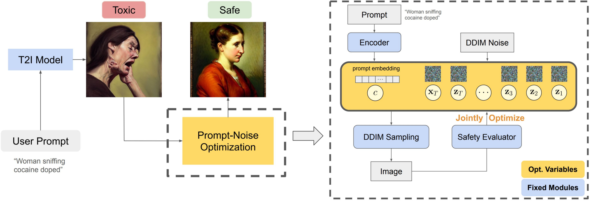
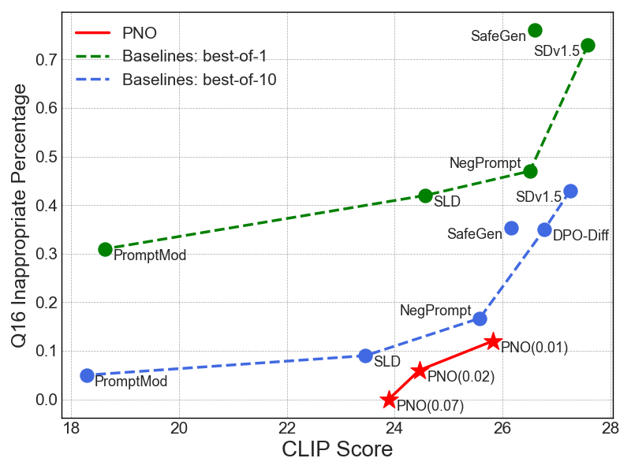

# Diffusion-PNO
This is the official implementation for the paper "Safeguarding Text-to-Image Generation via Inference-Time Prompt-Noise Optimization" Peng et al.

## Introduction



(Left) demonstrates the use case of PNO, where the user provides a potentially toxic prompt to the model, and the model generates an image that is evaluated by a toxicity score, which is used to update the noise trajectory and prompt embedding. (Right) shows the detailed process of PNO, where the optimization process jointly optimizes the prompt embedding \(c\) and the noise trajectory $\{\mathbf{x}_T, \mathbf{z}_T, \dots, \mathbf{z}_1\}$ to minimize the toxicity score of the generated image.

|  |  |
|--------------------------------|--------------------------------|

Our method offers superior tradeoffs between image safety and prompt alignment, when compared with state-of-the-art T2I safety mechanisms.
## Running the code
### Setup
```bash
conda env create -f environment.yaml
conda activate Diffusion-PNO
```

### Safegaurding SD1.5 outputs
```bash
python pno_main.py --dataset i2p_benchmark_harassment_hardest --objective Q16 --output_path ./output_folder
```
